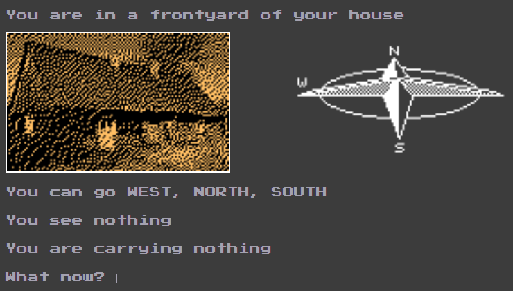
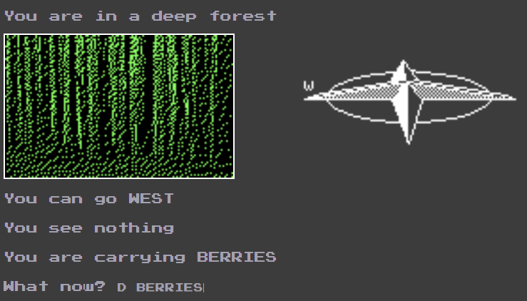
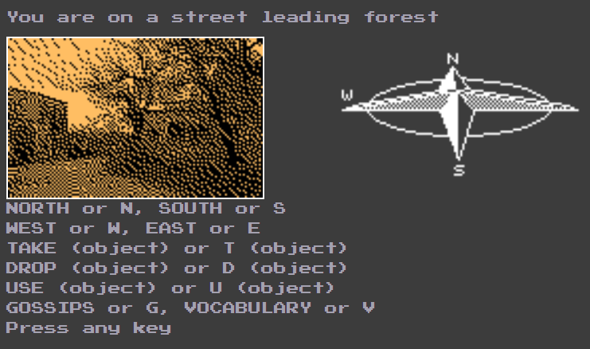

# Shoemaker

Project of a game from Atari 8 bit for client applications in JavaScript

<h2>Installation</h2>
After downloading repository launch a start.bat file and the game will appear in your browser. After turning off browser tab with the game all your progress in the game will disappear (there is no save system, like on Atari).

<h2>How to play</h2>
After launching the game you have to click any button three times to close informing windows. You start near your house. During the game you are going to use taken items to develop the poisoned sheep to kill the dragon.

You can take, drop or use particular item by writing down a command and the item you want to use.

If you want to know any gosspis or vocabulary of command, you can input letter "G" or "V".

Items can be used on particular places (like a spade can be used to get sulpher). Some of them can be used near the castle to construct the poisoned sheep, but some u have to use somewhere else. The game ends after killing the dragon and winning the prize.
